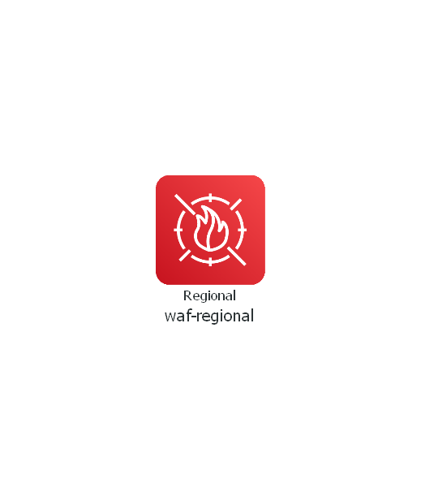

# terraform-aws-waf-regional

[](https://github.com/JamesWoolfenden/terraform-aws-waf-regional)
[](https://github.com/JamesWoolfenden/terraform-aws-waf-regional/releases/latest)
[](https://github.com/JamesWoolfenden/terraform-aws-waf-regional/releases/latest)

[](https://www.bridgecrew.cloud/link/badge?vcs=github&fullRepo=JamesWoolfenden%2Fterraform-aws-waf-regional&benchmark=CIS+AWS+V1.2)
[](https://github.com/pre-commit/pre-commit)
[](https://www.checkov.io/)
[](https://www.bridgecrew.cloud/link/badge?vcs=github&fullRepo=JamesWoolfenden%2Fterraform-aws-waf-regional&benchmark=INFRASTRUCTURE+SECURITY)

Terraform module - creates regional WAF

---

It's 100% Open Source and licensed under the [APACHE2](LICENSE).

## Usage

This here is just a basic illustration.



Include this repository as a module in your existing Terraform code:

```terraform
module "waf-regional" {
  source          = "JamesWoolfenden/waf-regional/aws"
  version         = "v0.0.3"
  ip_set          = var.ip_set
  common_tags     = var.common_tags
}
```

<!-- BEGINNING OF PRE-COMMIT-TERRAFORM DOCS HOOK -->

## Requirements

No requirements.

## Providers

| Name                                             | Version |
| ------------------------------------------------ | ------- |
| <a name="provider_aws"></a> [aws](#provider_aws) | n/a     |

## Modules

No modules.

## Resources

| Name                                                                                                                                    | Type     |
| --------------------------------------------------------------------------------------------------------------------------------------- | -------- |
| [aws_cloudwatch_log_group.wafexample](https://registry.terraform.io/providers/hashicorp/aws/latest/docs/resources/cloudwatch_log_group) | resource |
| [aws_wafregional_ipset.ips](https://registry.terraform.io/providers/hashicorp/aws/latest/docs/resources/wafregional_ipset)              | resource |
| [aws_wafregional_rule.ip_match](https://registry.terraform.io/providers/hashicorp/aws/latest/docs/resources/wafregional_rule)           | resource |
| [aws_wafregional_web_acl.ip_whitelist](https://registry.terraform.io/providers/hashicorp/aws/latest/docs/resources/wafregional_web_acl) | resource |

## Inputs

| Name                                                               | Description                                   | Type       | Default               | Required |
| ------------------------------------------------------------------ | --------------------------------------------- | ---------- | --------------------- | :------: |
| <a name="input_acl_name"></a> [acl_name](#input_acl_name)          | n/a                                           | `string`   | `"IPWhiteListWebACL"` |    no    |
| <a name="input_common_tags"></a> [common_tags](#input_common_tags) | Implement the common_tags scheme              | `map(any)` | n/a                   |   yes    |
| <a name="input_ipset"></a> [ipset](#input_ipset)                   | Complex object to describe and populate ipset | `any`      | n/a                   |   yes    |
| <a name="input_kms_key_id"></a> [kms_key_id](#input_kms_key_id)    | n/a                                           | `any`      | n/a                   |   yes    |
| <a name="input_metric_name"></a> [metric_name](#input_metric_name) | n/a                                           | `string`   | `"IPWhiteListWebACL"` |    no    |

## Outputs

| Name                                                                    | Description |
| ----------------------------------------------------------------------- | ----------- |
| <a name="output_ip_match"></a> [ip_match](#output_ip_match)             | n/a         |
| <a name="output_ip_whitelist"></a> [ip_whitelist](#output_ip_whitelist) | n/a         |
| <a name="output_ips"></a> [ips](#output_ips)                            | n/a         |

<!-- END OF PRE-COMMIT-TERRAFORM DOCS HOOK -->

## Related Projects

Check out these related projects.

- [terraform-aws-s3](https://github.com/jameswoolfenden/terraform-aws-s3) - S3 buckets

## Help

**Got a question?**

File a GitHub [issue](https://github.com/JamesWoolfenden/terraform-aws-waf-regional/issues).

## Contributing

### Bug Reports & Feature Requests

Please use the [issue tracker](https://github.com/JamesWoolfenden/terraform-aws-waf-regional/issues) to report any bugs or file feature requests.

## Copyrights

Copyright © 2019-2022 James Woolfenden

## License

[](https://opensource.org/licenses/Apache-2.0)

See [LICENSE](LICENSE) for full details.

Licensed to the Apache Software Foundation (ASF) under one
or more contributor license agreements. See the NOTICE file
distributed with this work for additional information
regarding copyright ownership. The ASF licenses this file
to you under the Apache License, Version 2.0 (the
"License"); you may not use this file except in compliance
with the License. You may obtain a copy of the License at

<https://www.apache.org/licenses/LICENSE-2.0>

Unless required by applicable law or agreed to in writing,
software distributed under the License is distributed on an
"AS IS" BASIS, WITHOUT WARRANTIES OR CONDITIONS OF ANY
KIND, either express or implied. See the License for the
specific language governing permissions and limitations
under the License.

### Contributors

[![James Woolfenden][jameswoolfenden_avatar]][jameswoolfenden_homepage]<br/>[James Woolfenden][jameswoolfenden_homepage]

[jameswoolfenden_homepage]: https://github.com/jameswoolfenden
[jameswoolfenden_avatar]: https://github.com/jameswoolfenden.png?size=150
[github]: https://github.com/jameswoolfenden
[linkedin]: https://www.linkedin.com/in/jameswoolfenden/
[twitter]: https://twitter.com/JimWoolfenden
[share_twitter]: https://twitter.com/intent/tweet/?text=terraform-aws-waf-regional&url=https://github.com/JamesWoolfenden/terraform-aws-waf-regional
[share_linkedin]: https://www.linkedin.com/shareArticle?mini=true&title=terraform-aws-waf-regional&url=https://github.com/JamesWoolfenden/terraform-aws-waf-regional
[share_reddit]: https://reddit.com/submit/?url=https://github.com/JamesWoolfenden/terraform-aws-waf-regional
[share_facebook]: https://facebook.com/sharer/sharer.php?u=https://github.com/JamesWoolfenden/terraform-aws-waf-regional
[share_email]: mailto:?subject=terraform-aws-waf-regional&body=https://github.com/JamesWoolfenden/terraform-aws-waf-regional
